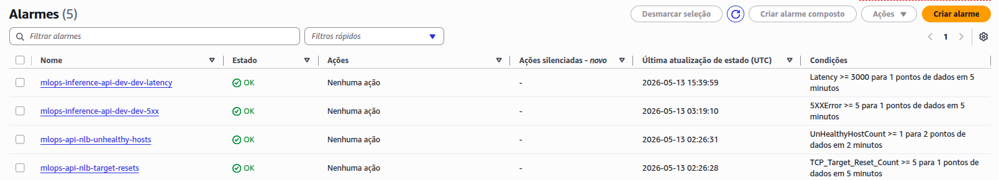
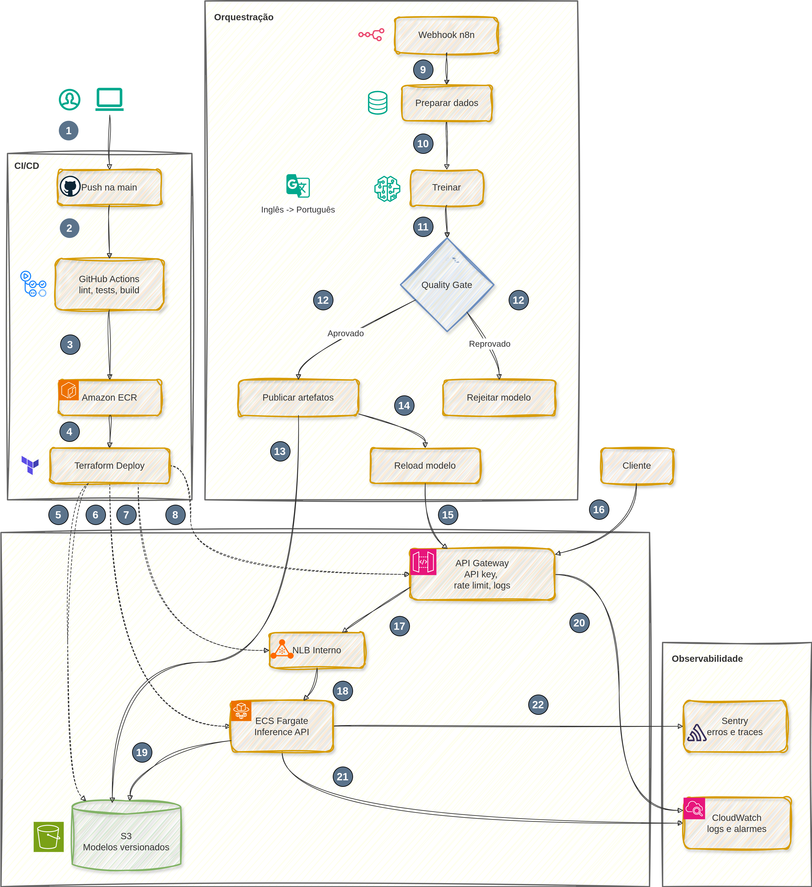

# MLOps Pipeline - EN -> PT Neural Machine Translation

Pipeline MLOps para treino, validacao, publicacao e serving de um modelo Transformer de traducao Ingles -> Portugues.

Stack principal:

| Camada | Tecnologia |
|---|---|
| ML | Python, TensorFlow, FastAPI |
| Orquestracao | n8n com workflow versionado em `n8n.json` |
| CI/CD | GitHub Actions, Docker, GHCR, ECR |
| Infraestrutura | Terraform, Amazon ECS Fargate, API Gateway, NLB, IAM, S3 |
| Observabilidade | Sentry e CloudWatch Logs |
| Ambiente local | Docker Compose, LocalStack S3 |

O projeto foi desenhado para operar de forma hibrida: o mesmo fluxo pode publicar artefatos em um bucket S3 real na AWS ou em um S3 simulado pelo LocalStack.

## Creditos e Escopo

O codigo-base dos modelos de ML foi desenvolvido no repositorio [jlsneto/mlops-challenge](https://github.com/jlsneto/mlops-challenge). Este projeto atribui os devidos creditos a essa base e foca na camada de MLOps: orquestracao, CI/CD, infraestrutura AWS, publicacao de artefatos, serving, observabilidade e execucao local com LocalStack.

| Componente original | Descricao |
|---|---|
| Preparacao de Dados | Download e tokenizacao do dataset ParaCrawl EN-PT via TensorFlow Datasets, exportando TFRecords prontos para treino |
| Treinamento | Modelo Transformer encoder-decoder com warmup schedule, masked loss/accuracy e versionamento automatico de artefatos |
| Inference API | API REST com FastAPI + Uvicorn para traducao em tempo real, metricas, health check e hot-reload de modelos |
| Testes | Suite de testes de contrato da API via Pytest + HTTPX |

## Execucao Rapida (Quick Start)

### Modo Local: LocalStack + n8n + S3 simulado

Use este modo para validar a orquestracao e a publicacao de artefatos sem criar recursos na AWS.

1. Crie o arquivo de ambiente:

```bash
cp .env.example .env
```

2. Suba LocalStack e n8n:

```bash
docker compose --profile orchestration up --build -d localstack n8n
```

3. Aguarde o n8n importar e publicar o workflow:

```bash
docker compose logs -f n8n
```

Procure por uma mensagem equivalente a `Workflow importado e publicado`.

4. Dispare uma execucao leve pelo webhook:

```bash
curl -X POST http://localhost:5678/webhook/mlops-nmt-pipeline \
  -H "Content-Type: application/json" \
  -H "x-api-key: local-dev-key" \
  -d '{
    "dataset_name": "para_crawl/enpt",
    "max_tokens": 64,
    "train_records": 1000,
    "val_records": 100,
    "epochs": 1,
    "batch_size": 32,
    "threshold": 0.30,
    "api_base_url": "http://localhost:8000",
    "api_gateway_api_key": "local-dev-key"
  }'
```

5. Liste os artefatos publicados no S3 local:

```bash
docker compose exec localstack awslocal s3 ls s3://mlops-local-artifacts/models --recursive
```

Quando credenciais AWS nao estao presentes, o publisher configura automaticamente:

| Variavel | Valor local padrao |
|---|---|
| `AWS_ENDPOINT_URL_S3` | `http://localstack:4566` |
| `ARTIFACT_BUCKET` | `mlops-local-artifacts` |
| `ARTIFACT_PREFIX` | `models` |
| `AWS_ACCESS_KEY_ID` | `test` |
| `AWS_SECRET_ACCESS_KEY` | `test` |

### Alternar entre S3 LocalStack e S3 real

| Modo | Como ativar | Comportamento |
|---|---|---|
| LocalStack | Nao defina credenciais AWS e deixe `ARTIFACT_BUCKET` vazio ou local | O publisher cria/usa `mlops-local-artifacts` no endpoint `http://localstack:4566` |
| AWS S3 real | Defina `AWS_ACCESS_KEY_ID`/`AWS_SECRET_ACCESS_KEY` e, se aplicavel, `AWS_SESSION_TOKEN`; configure tambem `ARTIFACT_BUCKET` | O publisher envia artefatos aprovados para o bucket real |
| AWS S3 com endpoint explicito | Defina `AWS_ENDPOINT_URL_S3` | O publisher usa o endpoint informado |

Exemplo para forcar LocalStack no `.env`:

```env
ARTIFACT_BUCKET=mlops-local-artifacts
ARTIFACT_PREFIX=models
AWS_REGION=us-east-1
AWS_ENDPOINT_URL_S3=http://localstack:4566
MLOPS_CREATE_ARTIFACT_BUCKET=true
```

Exemplo para usar S3 real:

```env
ARTIFACT_BUCKET=meu-bucket-de-modelos
ARTIFACT_PREFIX=models
AWS_REGION=us-east-1
AWS_ACCESS_KEY_ID=...
AWS_SECRET_ACCESS_KEY=...
```

### Modo Cloud: GitHub Actions + AWS

Use este modo para provisionar ECS, API Gateway, S3, IAM, logs e alarmes na AWS.

1. Configure os secrets do repositorio no GitHub:

| Nome | Tipo | Obrigatorio | Uso |
|---|---|---|---|
| `AWS_GITHUB_ACTIONS_ROLE_ARN` | Secret | Recomendado | Role assumida via OIDC pelo GitHub Actions |
| `AWS_ACCESS_KEY_ID` | Secret | Apenas se nao usar OIDC | Fallback para autenticar na AWS |
| `AWS_SECRET_ACCESS_KEY` | Secret | Apenas se nao usar OIDC | Fallback para autenticar na AWS |
| `API_GATEWAY_KEY` | Secret | Sim | Valor da API key criada/usada pelo API Gateway |
| `SENTRY_DSN` | Secret | Opcional | Envio de erros e traces para o Sentry |

2. Configure as repository variables quando quiser sobrescrever os padroes:

| Nome | Padrao | Uso |
|---|---|---|
| `AWS_REGION` | `us-east-1` | Regiao AWS |
| `PROJECT_NAME` | `mlops-api` | Prefixo dos recursos |
| `ECR_REPOSITORY` | `mlops-challenge` | Repositorio ECR |
| `ARTIFACT_BUCKET_NAME` | Gerado pelo Terraform | Bucket S3 de modelos aprovados |
| `ARTIFACT_PREFIX` | `models` | Prefixo dos modelos no S3 |
| `TERRAFORM_STATE_BUCKET` | `mlops-challenge-tfstate-<account>-<region>` | Backend remoto do Terraform |
| `API_GATEWAY_STAGE_NAME` | `dev` | Stage do API Gateway |
| `SENTRY_ENVIRONMENT` | `production` | Ambiente reportado ao Sentry |

3. Para OIDC, configure a trust policy da role permitindo o repositorio e a branch:

```text
repo:<usuario-ou-org>/<repo>:ref:refs/heads/main
```

4. Dispare o pipeline de cloud com push na `main`:

```bash
git push origin main
```

O workflow `ci-cd.yml` roda lint, testes, build e publicacao da imagem. Quando ele termina com sucesso na `main`, o workflow `deploy.yml` e acionado por `workflow_run`, publica a imagem no ECR, aplica Terraform para ECS + API Gateway e valida `/health`.

5. Depois do deploy, copie os outputs do resumo do GitHub Actions para o `.env` local usado pelo n8n:

```env
API_BASE_URL=https://<api-id>.execute-api.<region>.amazonaws.com/dev
API_GATEWAY_API_KEY=<mesmo-valor-de-API_GATEWAY_KEY>
ARTIFACT_BUCKET=<artifact_bucket_name>
ARTIFACT_PREFIX=models
AWS_REGION=us-east-1
SENTRY_DSN=<opcional>
```

6. Suba o n8n local e dispare o pipeline apontando para a API publicada:

```bash
docker compose --profile orchestration up --build -d n8n
```

```bash
source .env

curl -X POST http://localhost:5678/webhook/mlops-nmt-pipeline \
  -H "Content-Type: application/json" \
  -H "x-api-key: $API_GATEWAY_API_KEY" \
  -d "{
    \"dataset_name\": \"para_crawl/enpt\",
    \"max_tokens\": 64,
    \"train_records\": 12000,
    \"val_records\": 1200,
    \"epochs\": 10,
    \"batch_size\": 32,
    \"threshold\": 0.30,
    \"api_base_url\": \"${API_BASE_URL}\",
    \"api_gateway_api_key\": \"${API_GATEWAY_API_KEY}\"
  }"
```

7. Valide a API:

```bash
curl -H "x-api-key: $API_GATEWAY_API_KEY" "$API_BASE_URL/health"
```

```bash
curl -X POST "$API_BASE_URL/predict" \
  -H "x-api-key: $API_GATEWAY_API_KEY" \
  -H "Content-Type: application/json" \
  -d '{"text": "Hello, how are you?"}'
```

## Evidencias e Monitoramento

### Pipeline GitHub Actions - CI-CD


### Pipeline GitHub Actions - Deploy


### Workflow n8n


### Interface LocalStack/S3


### Logs Sentry


### Logs CloudWatch




## Arquitetura do Sistema



O n8n orquestra o ciclo operacional do modelo: prepara dados, executa treino, aplica o quality gate, publica somente runs aprovados e chama `/reload` quando a API remota esta configurada.

O Sentry fica acoplado a API FastAPI para capturar excecoes, erros controlados e traces. O CloudWatch recebe logs de ECS e API Gateway, alem de alarmes basicos de disponibilidade e latencia. Na AWS, o API Gateway e a entrada publica; o backend ECS fica atras de um NLB interno acessado por VPC Link.

## Troubleshooting

| Sintoma | Causa comum | Como resolver |
|---|---|---|
| `AccessDenied` ao assumir role OIDC | Trust policy nao permite o repositorio/branch | Ajuste o subject para `repo:<org>/<repo>:ref:refs/heads/main` e confirme `id-token: write` no workflow |
| `API_GATEWAY_KEY secret is empty or unavailable` | Secret nao criado no GitHub | Crie `API_GATEWAY_KEY` em Repository secrets e rode novo push na `main` |
| Terraform falha ao criar bucket de state | Nome ja existe ou permissao S3 insuficiente | Defina `TERRAFORM_STATE_BUCKET` com nome unico e garanta permissoes `s3:*` necessarias para state |
| ECS nao fica healthy | Task sem permissao, imagem invalida ou healthcheck falhando | Verifique `/ecs/<PROJECT_NAME>` no CloudWatch e confirme a imagem publicada no ECR |
| `/health` retorna `403` no API Gateway | Header `x-api-key` ausente ou valor incorreto | Envie `-H "x-api-key: $API_GATEWAY_API_KEY"` e confira o secret `API_GATEWAY_KEY` |
| n8n nao sobe | Porta `5678` ocupada | Defina `N8N_PORT=5679` no `.env` e suba novamente |
| LocalStack nao responde | Porta `4566` ocupada ou container ainda inicializando | Defina `LOCALSTACK_PORT=4567` ou aguarde o healthcheck com `docker compose ps` |
| Publisher usa LocalStack sem querer | Credenciais AWS nao estao no ambiente do container | Defina `AWS_ACCESS_KEY_ID`/`AWS_SECRET_ACCESS_KEY` e, se aplicavel, `AWS_SESSION_TOKEN`, alem de `ARTIFACT_BUCKET` |
| Publisher tenta S3 real sem querer | Credenciais AWS vazaram para o ambiente local | Remova credenciais do `.env` ou defina explicitamente `AWS_ENDPOINT_URL_S3=http://localstack:4566` |
| `NoSuchBucket` no publish | Bucket real nao existe e criacao automatica nao esta habilitada | Crie o bucket antes ou use `MLOPS_CREATE_ARTIFACT_BUCKET=true` quando aplicavel |

## Limpeza (Cleanup)

### Ambiente local

Parar containers preservando volumes:

```bash
docker compose down
```

Remover containers e volumes locais de n8n, cache TFDS e LocalStack:

```bash
docker compose down -v
```

### Recursos AWS

Destrua primeiro o API Gateway, depois o backend ECS/S3:

```bash
cd infra/aws/api-gateway
terraform init
terraform destroy
```

```bash
cd ../ecs
terraform init
terraform destroy
```

Se o deploy foi feito pelo GitHub Actions com backend remoto, use o mesmo bucket/regiao de state configurado no workflow ao rodar `terraform init`. Buckets S3 com objetos versionados podem exigir limpeza das versoes antes do `destroy`.

## Referencia Rapida

### Perfis Docker Compose

| Perfil | Comando | Uso |
|---|---|---|
| `orchestration` | `docker compose --profile orchestration up --build n8n` | n8n + LocalStack |
| `prepare` | `docker compose --profile prepare run --rm prepare_dataset` | Preparacao de dataset |
| `train` | `docker compose --profile train run --rm train` | Treino local |
| `publish` | `docker compose --profile publish run --rm publish_artifacts` | Publicacao de um run aprovado |
| `api` | `docker compose --profile api up --build api` | API local |
| `tests` | `docker compose --profile tests run --rm tests` | Testes automatizados |

### Variaveis de ambiente principais

| Variavel | Obrigatoria | Descricao |
|---|---|---|
| `API_BASE_URL` | Cloud | URL publica do API Gateway |
| `API_GATEWAY_API_KEY` | Cloud | API key usada pelo n8n e pelos clientes |
| `ARTIFACT_BUCKET` | Cloud | Bucket S3 dos modelos aprovados |
| `ARTIFACT_PREFIX` | Nao | Prefixo dos modelos, padrao `models` |
| `AWS_REGION` | Nao | Regiao AWS, padrao `us-east-1` |
| `AWS_ENDPOINT_URL_S3` | Local opcional | Endpoint S3 alternativo, usado para LocalStack |
| `MLOPS_CREATE_ARTIFACT_BUCKET` | Local opcional | Permite criar bucket automaticamente |
| `SENTRY_DSN` | Opcional | DSN para envio de erros/traces |
| `DEFAULT_RUN_ID` | Opcional | Run carregado pela API ao iniciar |

### Estrutura

| Caminho | Responsabilidade |
|---|---|
| `ml/` | Preparacao de dados, tokenizacao, modelo e treino |
| `mlops/validation/` | Quality gate |
| `mlops/deployment/` | Publicacao de artefatos |
| `inference_api/` | API FastAPI de inferencia e reload |
| `infra/aws/ecs/` | ECS Fargate, NLB, S3, IAM e CloudWatch |
| `infra/aws/api-gateway/` | API Gateway, VPC Link, usage plan, logs e alarmes |
| `.github/workflows/` | CI/CD e deploy cloud |
| `n8n.json` | Workflow de orquestracao |
| [`docs/README_N8N.md`](docs/README_N8N.md) | Guia operacional do workflow n8n |
| [`docs/README_DEPLOY.md`](docs/README_DEPLOY.md) | Guia operacional de deploy AWS |

## Testes de cobertura

Use sempre `python -m pytest` para garantir que o pytest executado e o plugin `pytest-cov` pertencem ao ambiente Python correto.

Com o ambiente conda `mlops`:

```bash
conda run -n mlops python -m pytest --cov=ml --cov=mlops --cov=inference_api --cov-report=term-missing
```

Para gerar o relatorio HTML:

```bash
conda run -n mlops python -m pytest --cov=ml --cov=mlops --cov=inference_api --cov-report=term-missing --cov-report=html
```

O relatorio fica em:

```bash
htmlcov/index.html
```

Para testar apenas os modulos de treino e preparacao de dataset:

```bash
conda run -n mlops python -m pytest tests/test_ml_pipeline_units.py --cov=ml.train --cov=ml.prepare_dataset --cov-report=term-missing
```
