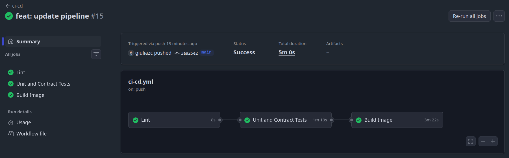
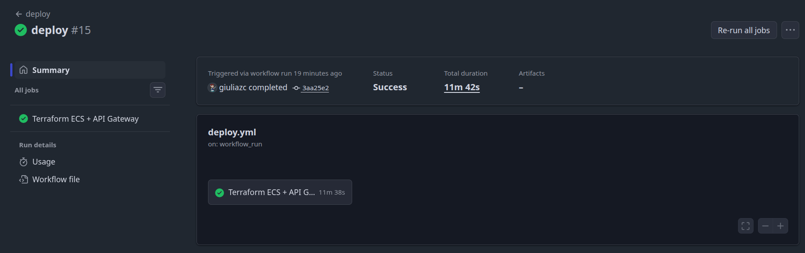
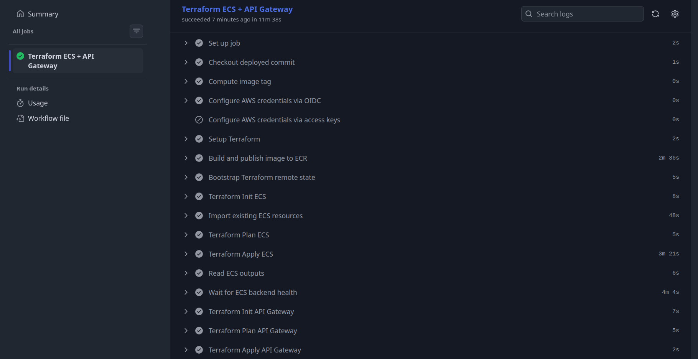
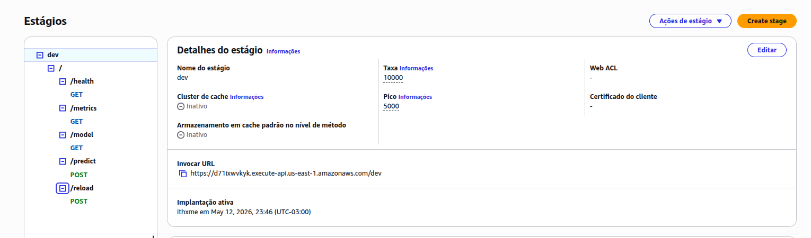
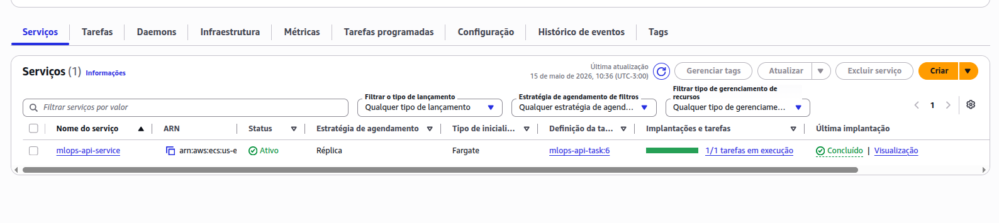
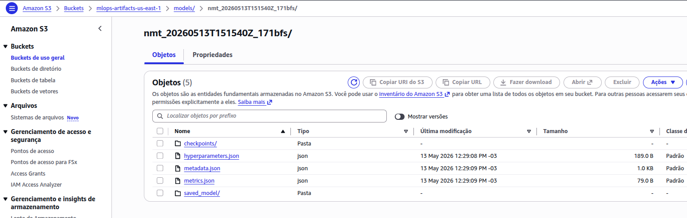
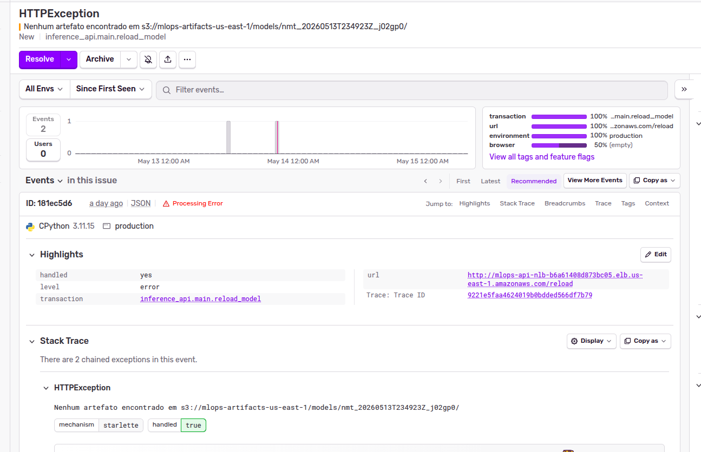
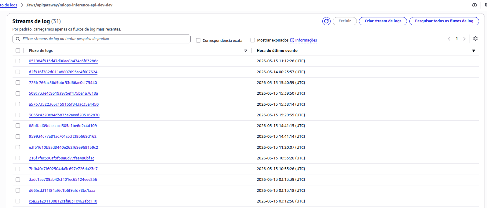
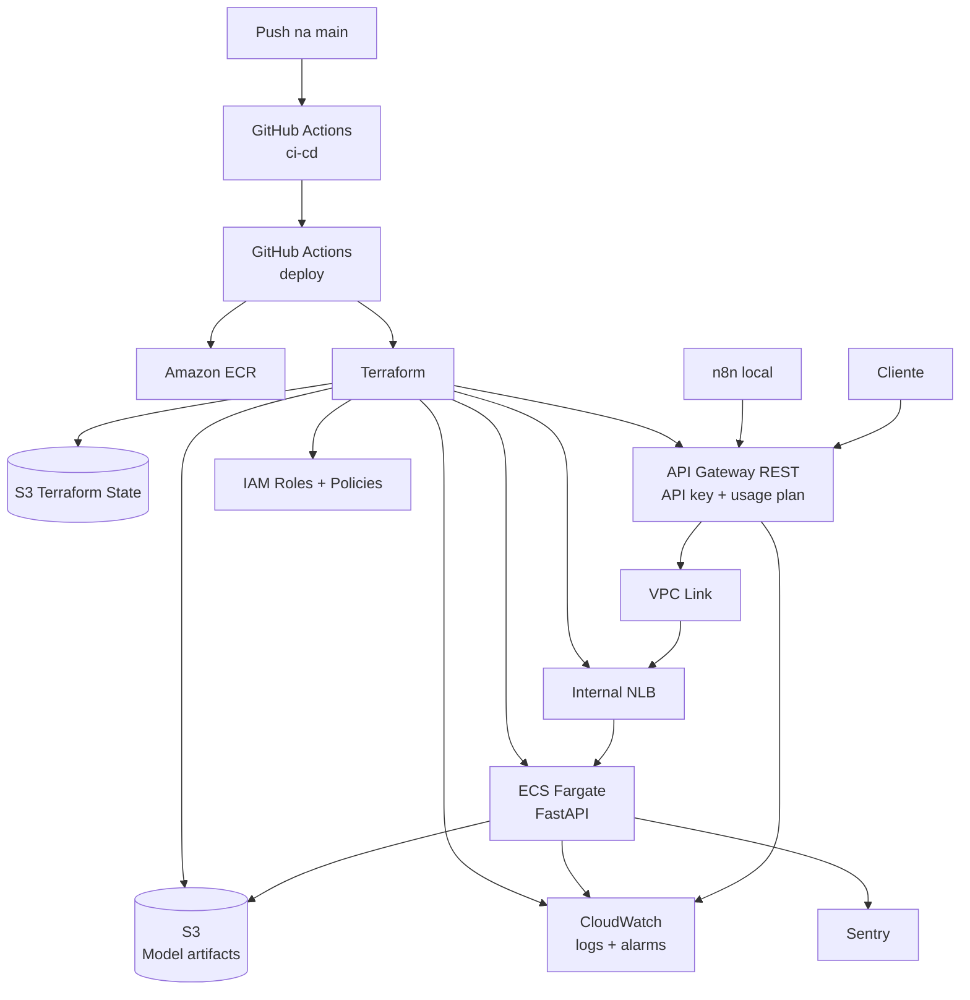

# Deploy AWS - ECS Fargate + API Gateway + S3

Este guia documenta o deploy cloud do pipeline MLOps. O objetivo e publicar a Inference API em ECS Fargate, expor a entrada publica via AWS API Gateway, armazenar modelos aprovados em S3 e centralizar logs/alarmes no CloudWatch.

Stack de deploy:

| Camada | Tecnologia |
|---|---|
| CI/CD | GitHub Actions |
| Container registry | Amazon ECR |
| Infraestrutura | Terraform |
| Compute | ECS Fargate |
| Entrada publica | API Gateway REST + API key + usage plan |
| Rede | NLB interno + VPC Link |
| Artefatos | Amazon S3 versionado |
| Observabilidade | CloudWatch Logs, CloudWatch Alarms e Sentry |

## Execucao Rapida

### Modo Recomendado: GitHub Actions

Use este modo para o deploy completo e reprodutivel em ambiente cloud.

1. Configure os secrets do repositorio:

| Secret | Obrigatorio | Descricao |
|---|---|---|
| `AWS_GITHUB_ACTIONS_ROLE_ARN` | Recomendado | Role AWS assumida via OIDC |
| `AWS_ACCESS_KEY_ID` | Apenas sem OIDC | Access key de fallback |
| `AWS_SECRET_ACCESS_KEY` | Apenas sem OIDC | Secret key de fallback |
| `API_GATEWAY_KEY` | Sim | Valor da API key do API Gateway |
| `SENTRY_DSN` | Opcional | DSN para erros/traces da API |

2. Configure repository variables quando quiser sobrescrever os padroes:

| Variable | Padrao | Descricao |
|---|---|---|
| `AWS_REGION` | `us-east-1` | Regiao AWS |
| `PROJECT_NAME` | `mlops-api` | Prefixo dos recursos |
| `ECR_REPOSITORY` | `mlops-challenge` | Nome do repositorio ECR |
| `ARTIFACT_BUCKET_NAME` | Gerado pelo Terraform | Bucket S3 dos modelos aprovados |
| `ARTIFACT_PREFIX` | `models` | Prefixo dos modelos no S3 |
| `TERRAFORM_STATE_BUCKET` | `mlops-challenge-tfstate-<account>-<region>` | Bucket de state remoto |
| `API_GATEWAY_STAGE_NAME` | `dev` | Stage do API Gateway |
| `API_GATEWAY_NAME` | `mlops-inference-api-dev` | Nome do REST API |
| `API_GATEWAY_CLIENT_KEY_NAME` | `mlops-client-dev` | Nome da API key |
| `API_GATEWAY_RATE_LIMIT` | `20` | Rate limit sustentado do usage plan |
| `API_GATEWAY_BURST_LIMIT` | `40` | Burst permitido |
| `ECS_LOG_RETENTION_DAYS` | `14` | Retencao dos logs ECS |
| `API_GATEWAY_LOG_RETENTION_DAYS` | `14` | Retencao dos access logs |
| `CLOUDWATCH_ALARM_ACTIONS_JSON` | `[]` | ARNs SNS/actions para alarmes |
| `SENTRY_ENVIRONMENT` | `production` | Ambiente enviado ao Sentry |
| `SENTRY_TRACES_SAMPLE_RATE` | `0.2` | Sample rate de traces |

3. Para OIDC, configure a trust policy da role com o repositorio e a branch:

```text
repo:<usuario-ou-org>/<repo>:ref:refs/heads/main
```

4. Dispare o deploy com push na `main`:

```bash
git push origin main
```

O workflow [`ci-cd.yml`](../.github/workflows/ci-cd.yml) executa lint, testes, build e publicacao da imagem. Quando conclui com sucesso na `main`, o workflow [`deploy.yml`](../.github/workflows/deploy.yml) publica a imagem no ECR, provisiona ECS + API Gateway com Terraform e valida `/health` pelo Gateway.

5. Ao final, copie estes valores do summary do GitHub Actions:

| Output | Onde usar |
|---|---|
| `API Gateway` | `API_BASE_URL` no `.env` local |
| `Artifact bucket` | `ARTIFACT_BUCKET` no `.env` local |
| `Artifact prefix` | `ARTIFACT_PREFIX` no `.env` local |
| `ECS logs` | Consulta no CloudWatch |
| `Gateway logs` | Consulta no CloudWatch |
| `Terraform state bucket` | Cleanup ou execucoes manuais futuras |

6. Atualize o `.env` local usado pelo n8n:

```env
API_BASE_URL=https://<api-id>.execute-api.<region>.amazonaws.com/dev
API_GATEWAY_API_KEY=<mesmo-valor-de-API_GATEWAY_KEY>
ARTIFACT_BUCKET=<artifact_bucket_name>
ARTIFACT_PREFIX=models
AWS_REGION=us-east-1
SENTRY_DSN=
```

### Modo Manual: Terraform Local

Use este modo quando quiser provisionar a infraestrutura sem GitHub Actions. Ele exige AWS CLI autenticado e uma imagem Docker ja publicada em um registry acessivel pelo ECS.

1. Publique a imagem no ECR:

```bash
export AWS_REGION=us-east-1
export AWS_ACCOUNT_ID="$(aws sts get-caller-identity --query Account --output text)"
export ECR_REPO_NAME=mlops-challenge
export IMAGE_TAG=latest
./scripts/push-to-ecr.sh
```

Guarde a URI da imagem, por exemplo:

```text
123456789012.dkr.ecr.us-east-1.amazonaws.com/mlops-challenge:latest
```

2. Provisione ECS, NLB interno, S3, IAM e CloudWatch:

```bash
cd infra/aws/ecs
cp terraform.tfvars.example terraform.tfvars
```

Edite `terraform.tfvars`:

```hcl
aws_region      = "us-east-1"
project_name    = "mlops-api"
container_image = "123456789012.dkr.ecr.us-east-1.amazonaws.com/mlops-challenge:latest"
artifact_prefix = "models"
sentry_dsn      = ""
```

Execute:

```bash
terraform init
terraform plan
terraform apply
```

3. Copie os outputs do ECS:

```bash
terraform output
```

Valores importantes:

| Output | Uso |
|---|---|
| `backend_base_url` | Entrada privada do NLB usada pelo API Gateway |
| `backend_nlb_arn` | Target do VPC Link |
| `artifact_bucket_name` | Bucket de modelos aprovados |
| `artifact_prefix` | Prefixo dos modelos |
| `ecs_log_group_name` | Log group da API |

4. Provisione o API Gateway:

```bash
cd ../api-gateway
cp terraform.tfvars.example terraform.tfvars
```

Edite `terraform.tfvars` com os outputs do ECS:

```hcl
aws_region           = "us-east-1"
api_name             = "mlops-inference-api-dev"
stage_name           = "dev"
backend_base_url     = "http://internal-mlops-api-nlb-..."
vpc_link_target_arn  = "arn:aws:elasticloadbalancing:..."
client_api_key_name  = "mlops-client-dev"
client_api_key_value = "<gere-com-openssl-rand-hex-32>"
```

Execute:

```bash
terraform init
terraform plan
terraform apply
```

5. Copie os outputs do API Gateway:

```bash
terraform output
```

Valores importantes:

| Output | Uso |
|---|---|
| `api_gateway_base_url` | `API_BASE_URL` para clientes e n8n |
| `access_log_group_name` | Access logs no CloudWatch |
| `vpc_link_id` | Diagnostico de rede Gateway -> NLB |
| `client_api_key_id` | ID da chave criada; o valor real fica no secret/tfvars |

## Validacao do Deploy

### Health check

```bash
source .env

curl -H "x-api-key: $API_GATEWAY_API_KEY" "$API_BASE_URL/health"
```

Resposta esperada:

```json
{
  "status": "healthy",
  "model_loaded": false
}
```

`model_loaded` pode iniciar como `false` ate que o n8n publique um run aprovado e chame `/reload`.

### Predicao

```bash
curl -X POST "$API_BASE_URL/predict" \
  -H "x-api-key: $API_GATEWAY_API_KEY" \
  -H "Content-Type: application/json" \
  -d '{"text": "Hello, how are you?"}'
```

### Logs

```bash
aws logs tail /ecs/mlops-api --follow --region us-east-1
```

Para API Gateway, use o output `access_log_group_name`:

```bash
aws logs tail "<access_log_group_name>" --follow --region us-east-1
```

## Evidencias e Monitoramento

### GitHub Actions - CI/CD



### GitHub Actions - Deploy





### API Gateway



### ECS Fargate



### S3 Artefatos



### Sentry



### CloudWatch Logs



## Arquitetura do Deploy



### Componentes provisionados

| Modulo | Recursos principais |
|---|---|
| `infra/aws/ecs` | ECS cluster/service, task definition, NLB interno, target group, security group, IAM, S3 de artefatos, CloudWatch logs e alarmes |
| `infra/aws/api-gateway` | REST API, stage, VPC Link, API key, usage plan, access logs e alarmes |
| `deploy.yml` | ECR, backend remoto do Terraform, imports defensivos, plan/apply e smoke test `/health` |

O API Gateway e a unica entrada publica. O ECS fica atras de um NLB interno acessado por VPC Link. A API le modelos aprovados no bucket S3 e envia logs para CloudWatch; erros/traces de aplicacao seguem para Sentry quando `SENTRY_DSN` esta configurado.

## Integracao com n8n

Depois do deploy, o n8n local usa:

| Variavel | Valor |
|---|---|
| `API_BASE_URL` | Output `api_gateway_base_url` |
| `API_GATEWAY_API_KEY` | Mesmo valor de `API_GATEWAY_KEY` |
| `ARTIFACT_BUCKET` | Output `artifact_bucket_name` |
| `ARTIFACT_PREFIX` | Output `artifact_prefix` |
| `AWS_REGION` | Mesma regiao do deploy |

Quando o workflow n8n publica artefatos em S3 real, ele chama `/reload` no API Gateway. Quando publica no LocalStack, ele retorna `published_local_only` e nao atualiza a API em ECS.

Guia do workflow: [`docs/README_N8N.md`](README_N8N.md).

## Troubleshooting

| Sintoma | Causa comum | Como resolver |
|---|---|---|
| Deploy nao inicia apos push | `ci-cd` falhou ou push nao foi na `main` | Abra Actions, corrija CI e faca novo push na `main` |
| `AccessDenied` no OIDC | Trust policy nao permite repo/branch | Use subject `repo:<org>/<repo>:ref:refs/heads/main` e confirme `id-token: write` |
| `API_GATEWAY_KEY secret is empty or unavailable` | Secret ausente | Crie `API_GATEWAY_KEY` em Repository secrets |
| Falha ao criar bucket de state | Nome global ja existe ou falta permissao S3 | Defina `TERRAFORM_STATE_BUCKET` unico e confira permissoes S3 |
| ECS service nao estabiliza | Imagem invalida, erro na app ou permissao IAM | Verifique `/ecs/<PROJECT_NAME>` no CloudWatch e a imagem no ECR |
| Target group unhealthy | Healthcheck falhando ou porta errada | Confirme container na porta `8000` e `/health` funcionando |
| API Gateway retorna `403` | Header `x-api-key` ausente/incorreto | Envie `-H "x-api-key: $API_GATEWAY_API_KEY"` |
| API Gateway retorna `5xx` | Falha no VPC Link, NLB ou backend ECS | Verifique access logs do Gateway, target health do NLB e logs ECS |
| `/reload` nao atualiza modelo | Artefato nao esta no S3 real ou quality gate rejeitou | Confira resposta do n8n, bucket/prefixo e logs ECS |
| Sentry nao recebe eventos | `SENTRY_DSN` vazio ou ambiente bloqueado | Configure secret `SENTRY_DSN` e redeploy |

## Limpeza (Cleanup)

### Recursos locais

```bash
docker compose down
```

Para remover volumes locais:

```bash
docker compose down -v
```

### Recursos AWS via Terraform manual

Destrua primeiro o API Gateway, depois ECS/S3:

```bash
cd infra/aws/api-gateway
terraform init
terraform destroy
```

```bash
cd ../ecs
terraform init
terraform destroy
```

### Recursos AWS criados pelo GitHub Actions

Use o mesmo backend remoto criado pelo workflow:

```bash
cd infra/aws/api-gateway
terraform init \
  -backend-config="bucket=<terraform-state-bucket>" \
  -backend-config="key=api-gateway/terraform.tfstate" \
  -backend-config="region=<aws-region>" \
  -backend-config="encrypt=true"
terraform destroy
```

```bash
cd ../ecs
terraform init \
  -backend-config="bucket=<terraform-state-bucket>" \
  -backend-config="key=ecs/terraform.tfstate" \
  -backend-config="region=<aws-region>" \
  -backend-config="encrypt=true"
terraform destroy
```

Buckets S3 versionados podem bloquear o `destroy` se existirem objetos/versoes. Em ambiente descartavel, `artifact_bucket_force_destroy = true` ajuda, mas use com cuidado.

## Checklist de Validacao

| Item | Como validar |
|---|---|
| Deploy Actions concluiu | Workflow `deploy` verde |
| API exige chave | `/health` sem `x-api-key` retorna `403` |
| Health check publico funciona | `/health` com `x-api-key` retorna `200` |
| ECS esta estavel | Service stable e target group healthy |
| S3 de artefatos existe | Bucket output `artifact_bucket_name` criado |
| Logs ECS existem | Log group `/ecs/<PROJECT_NAME>` recebe eventos |
| Logs API Gateway existem | Output `access_log_group_name` recebe eventos |
| Alarmes existem | CloudWatch Alarms de NLB e Gateway criados |
| Sentry funciona | Erro controlado aparece no projeto Sentry quando DSN configurado |
