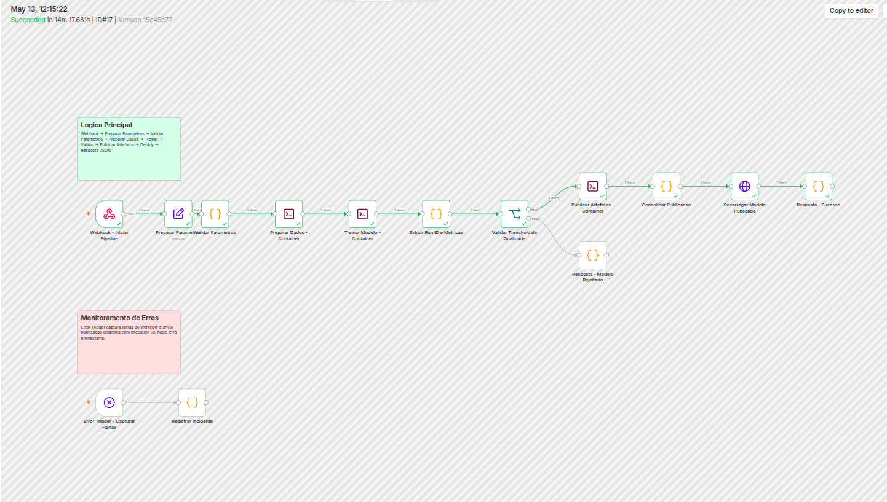
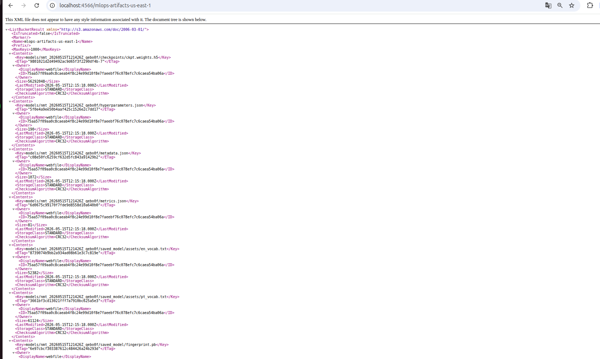
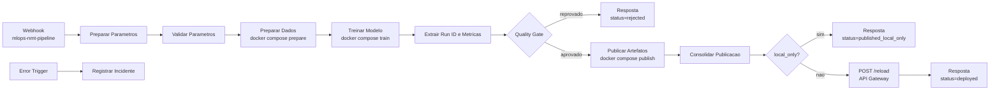

# n8n - Orquestracao do Pipeline MLOps EN -> PT

Este guia documenta o workflow n8n versionado em [`n8n.json`](../n8n.json). Ele orquestra o pipeline de MLOps do projeto: prepara dados, treina o modelo, aplica quality gate, publica artefatos aprovados no S3 real ou no LocalStack e recarrega a API quando a publicacao acontece em S3 AWS.

Stack envolvida:

| Camada | Tecnologia |
|---|---|
| Orquestracao | n8n com workflow autoimportado |
| Execucao | Docker Compose e nodes `Execute Command` |
| Storage | Amazon S3 ou LocalStack S3 |
| Serving | FastAPI atras do AWS API Gateway |
| Observabilidade | Error Trigger do n8n, Sentry na API e CloudWatch na AWS |

## Execucao Rapida

### Modo Local: n8n + LocalStack S3

Use este modo para validar o fluxo de orquestracao sem depender de credenciais AWS. O publisher detecta a ausencia de credenciais e usa LocalStack automaticamente.

1. A partir da raiz do repositorio, crie o `.env`:

```bash
cp .env.example .env
```

2. Suba n8n e LocalStack:

```bash
docker compose --profile orchestration up --build -d localstack n8n
```

3. Acompanhe a importacao automatica do workflow:

```bash
docker compose logs -f n8n
```

Procure por uma mensagem equivalente a `Workflow importado e publicado`.

4. Acesse a interface:

```text
http://localhost:5678
```

5. Dispare uma execucao leve:

```bash
curl -X POST http://localhost:5678/webhook/mlops-nmt-pipeline \
  -H "Content-Type: application/json" \
  -H "x-api-key: local-dev-key" \
  -d '{
    "dataset_name": "para_crawl/enpt",
    "max_tokens": 64,
    "train_records": 1000,
    "val_records": 100,
    "epochs": 1,
    "batch_size": 32,
    "threshold": 0.30,
    "api_base_url": "http://localhost:8000",
    "api_gateway_api_key": "local-dev-key"
  }'
```

No modo LocalStack, a publicacao retorna `status=published_local_only` e o workflow pula o reload remoto. O campo `api_base_url` ainda e obrigatorio porque o node `Validar Parametros` valida o contrato completo antes de executar o pipeline.

6. Liste os artefatos publicados no S3 local:

```bash
docker compose exec localstack awslocal s3 ls s3://mlops-local-artifacts/models --recursive
```

### Modo Cloud: n8n + S3 real + API Gateway

Use este modo depois do deploy AWS pelo pipeline do GitHub Actions.

1. Preencha o `.env` com os outputs do deploy:

```env
API_BASE_URL=https://<api-id>.execute-api.<region>.amazonaws.com/dev
API_GATEWAY_API_KEY=<valor-da-api-key>
ARTIFACT_BUCKET=<bucket-s3-de-artefatos>
ARTIFACT_PREFIX=models
AWS_REGION=us-east-1
```

2. Exponha credenciais AWS no ambiente local ou no `.env` quando for publicar em S3 real. O comando do workflow repassa `AWS_ACCESS_KEY_ID`, `AWS_SECRET_ACCESS_KEY` e `AWS_SESSION_TOKEN` para o container `publish_artifacts`:

```env
AWS_ACCESS_KEY_ID=
AWS_SECRET_ACCESS_KEY=
AWS_SESSION_TOKEN=
```

3. Suba o n8n:

```bash
docker compose --profile orchestration up --build -d n8n
```

4. Dispare o pipeline apontando para a API publicada:

```bash
source .env

curl -X POST http://localhost:5678/webhook/mlops-nmt-pipeline \
  -H "Content-Type: application/json" \
  -H "x-api-key: $API_GATEWAY_API_KEY" \
  -d "{
    \"dataset_name\": \"para_crawl/enpt\",
    \"max_tokens\": 64,
    \"train_records\": 12000,
    \"val_records\": 1200,
    \"epochs\": 10,
    \"batch_size\": 32,
    \"threshold\": 0.30,
    \"api_base_url\": \"${API_BASE_URL}\",
    \"api_gateway_api_key\": \"${API_GATEWAY_API_KEY}\"
  }"
```

Quando o modelo e aprovado e a publicacao usa S3 real, o workflow chama `POST /reload` no API Gateway.

## Notas Operacionais

O servico `n8n` monta o Docker socket local para que os nodes `Execute Command` executem os servicos `prepare_dataset`, `train` e `publish_artifacts` definidos no [`docker-compose.yml`](../docker-compose.yml). Essa abordagem e adequada para o ambiente local de teste; em producao, substitua por um executor controlado, fila, CI/CD ou orquestrador com permissoes minimas.

O container importa e publica [`n8n.json`](../n8n.json) automaticamente na inicializacao. O bootstrap grava um checksum no volume `n8n_data`; quando o JSON muda, o workflow e reimportado antes do servidor n8n iniciar.

No n8n v2, o node `Execute Command` precisa estar habilitado. O Compose define `NODES_EXCLUDE='["n8n-nodes-base.localFileTrigger"]'`, mantendo o `Execute Command` disponivel e desabilitando apenas o `Local File Trigger`.

## Contrato do Webhook

Endpoint:

```text
POST /webhook/mlops-nmt-pipeline
```

Campos aceitos:

| Campo | Obrigatorio | Padrao | Descricao |
|---|---|---|---|
| `dataset_name` | Nao | `para_crawl/enpt` | Dataset usado pelo `ml.prepare_dataset` |
| `max_tokens` | Nao | `64` | Tamanho maximo de tokens |
| `train_records` | Nao | `20000` | Quantidade de registros de treino |
| `val_records` | Nao | `2000` | Quantidade de registros de validacao |
| `seed` | Nao | `42` | Seed de reproducibilidade |
| `epochs` | Nao | `10` | Epocas de treino |
| `batch_size` | Nao | `32` | Batch size |
| `threshold` | Nao | `0.30` | Threshold minimo do quality gate |
| `git_sha` | Nao | `unknown` | SHA associado ao run |
| `api_base_url` | Sim | vazio | URL da API local ou do API Gateway |
| `api_gateway_api_key` | Sim | header `x-api-key` | API key usada no reload |

Exemplo completo:

```json
{
  "dataset_name": "para_crawl/enpt",
  "max_tokens": 64,
  "train_records": 12000,
  "val_records": 1200,
  "seed": 42,
  "epochs": 10,
  "batch_size": 32,
  "threshold": 0.3,
  "git_sha": "unknown",
  "api_base_url": "https://abc123.execute-api.us-east-1.amazonaws.com/dev",
  "api_gateway_api_key": "..."
}
```

## Evidencias e Monitoramento

### Workflow n8n




### Artefatos no LocalStack/S3



## Arquitetura do Workflow



### Como funciona

| Etapa | Node | Responsabilidade | Resultado |
|---|---|---|---|
| Entrada | `Webhook - Iniciar Pipeline` | Recebe payload e headers | Dados brutos da execucao |
| Parametros | `Preparar Parametros` | Aplica defaults e extrai `x-api-key` | Configuracao normalizada |
| Validacao | `Validar Parametros` | Valida inteiros, threshold, dataset, URL e API key | Pipeline autorizado a rodar |
| Preparacao | `Preparar Dados - Container` | Executa `docker compose run --rm prepare_dataset` | TFRecords em `data/processed/` |
| Treino | `Treinar Modelo - Container` | Executa `docker compose run --rm train` | Artefatos em `artifacts/<run_id>/` |
| Metricas | `Extrair Run ID e Metricas` | Le metadata do treino | `run_id`, metrica e status |
| Quality gate | `Validar Threshold de Qualidade` | Aprova somente modelo acima do threshold | Rota aprovada ou rejeitada |
| Publicacao | `Publicar Artefatos - Container` | Executa `publish_artifacts` | Upload para S3 real ou LocalStack |
| Decisao | `Verificar Backend de Artefatos` | Verifica `publication.local_only` | Decide reload ou encerramento local |
| Reload | `Recarregar Modelo Publicado` | Chama `/reload` no API Gateway | Modelo atualizado na API |
| Erros | `Error Trigger - Capturar Falhas` | Centraliza falhas do workflow | Incidente estruturado |

## S3 Real vs LocalStack

| Modo | Como ativar | Resultado no workflow |
|---|---|---|
| LocalStack | Nao forneca credenciais AWS ao container | Publica em `mlops-local-artifacts` e retorna `published_local_only` |
| S3 real | Configure credenciais AWS e `ARTIFACT_BUCKET` | Publica em `s3://<bucket>/<prefix>/<run_id>` e chama `/reload` |
| Endpoint customizado | Configure `AWS_ENDPOINT_URL_S3` | Usa o endpoint informado para operacoes S3 |

Variaveis principais:

| Variavel | Uso |
|---|---|
| `API_BASE_URL` | URL usada pelo reload, normalmente API Gateway |
| `API_GATEWAY_API_KEY` | Chave enviada para `/reload` |
| `ARTIFACT_BUCKET` | Bucket de destino dos artefatos |
| `ARTIFACT_PREFIX` | Prefixo dos modelos, padrao `models` |
| `AWS_REGION` | Regiao do S3 |
| `AWS_ENDPOINT_URL_S3` | Endpoint alternativo, como LocalStack |
| `MLOPS_CREATE_ARTIFACT_BUCKET` | Cria bucket automaticamente quando suportado |

## Respostas do Webhook

### Modelo aprovado e publicado em S3 real

```json
{
  "status": "deployed",
  "deploy_blocked": false,
  "run_id": "nmt_20260508T120000Z_abc123",
  "metric_name": "val_token_accuracy",
  "metric_value": 0.42,
  "threshold": 0.3,
  "artifact_publication": {
    "bucket": "mlops-api-artifacts-123456789012-us-east-1",
    "prefix": "models",
    "s3_uri": "s3://mlops-api-artifacts-123456789012-us-east-1/models/nmt_20260508T120000Z_abc123"
  }
}
```

### Modelo aprovado e publicado no LocalStack

```json
{
  "status": "published_local_only",
  "deploy_blocked": false,
  "reload_skipped": true,
  "reload_skip_reason": "artifact_published_to_localstack",
  "run_id": "nmt_20260508T120000Z_abc123"
}
```

### Modelo rejeitado pelo quality gate

```json
{
  "status": "rejected",
  "deploy_blocked": true,
  "reason": "quality_gate_failed",
  "run_id": "nmt_20260508T120000Z_def456",
  "metric_value": 0.12,
  "threshold": 0.3
}
```

## Troubleshooting

| Sintoma | Causa comum | Como resolver |
|---|---|---|
| `Parametros invalidos: api_base_url invalida` | Payload sem `api_base_url` | Envie `api_base_url` mesmo em teste local, por exemplo `http://localhost:8000` |
| `api_gateway_api_key deve ser informado` | Header `x-api-key` ausente e payload sem chave | Envie `-H "x-api-key: ..."` ou `api_gateway_api_key` no JSON |
| Workflow nao aparece no n8n | Bootstrap ainda nao importou ou container antigo | Rode `docker compose logs -f n8n` e recrie com `docker compose --profile orchestration up --build -d n8n` |
| Node `Execute Command` falha | Docker socket nao montado ou Docker indisponivel | Confirme `/var/run/docker.sock` e rode a partir da raiz do repositorio |
| Publicacao cai em LocalStack sem querer | Credenciais AWS nao chegaram ao container | Exporte `AWS_ACCESS_KEY_ID`, `AWS_SECRET_ACCESS_KEY` e, se aplicavel, `AWS_SESSION_TOKEN` no ambiente do Compose |
| Reload falha com `403` | API key do Gateway incorreta | Confira `API_GATEWAY_API_KEY` e o secret `API_GATEWAY_KEY` usado no deploy |
| Reload falha apos LocalStack | API remota nao acessa S3 local | Use S3 real para atualizar ECS; LocalStack e apenas validacao local |
| Porta `5678` ocupada | Outro n8n rodando | Defina `N8N_PORT=5679` no `.env` |

## Limpeza

Parar containers mantendo volumes:

```bash
docker compose down
```

Remover tambem volumes de n8n, cache TFDS e LocalStack:

```bash
docker compose down -v
```

## Arquivos Relacionados

| Arquivo | Uso |
|---|---|
| [`n8n.json`](../n8n.json) | Workflow autoimportado |
| [`docker-compose.yml`](../docker-compose.yml) | Servicos usados pelos nodes `Execute Command` |
| [`README.md`](../README.md) | Guia principal do projeto |
| [`ml/train.py`](../ml/train.py) | Treino, metricas e `run_id` |
| [`mlops/deployment/publish_artifacts.py`](../mlops/deployment/publish_artifacts.py) | Publicacao em S3/LocalStack |
| [`inference_api/main.py`](../inference_api/main.py) | Endpoint `/reload` |
| [`tests/test_pipeline_contract.py`](../tests/test_pipeline_contract.py) | Contrato de quality gate, publicacao e reload |
